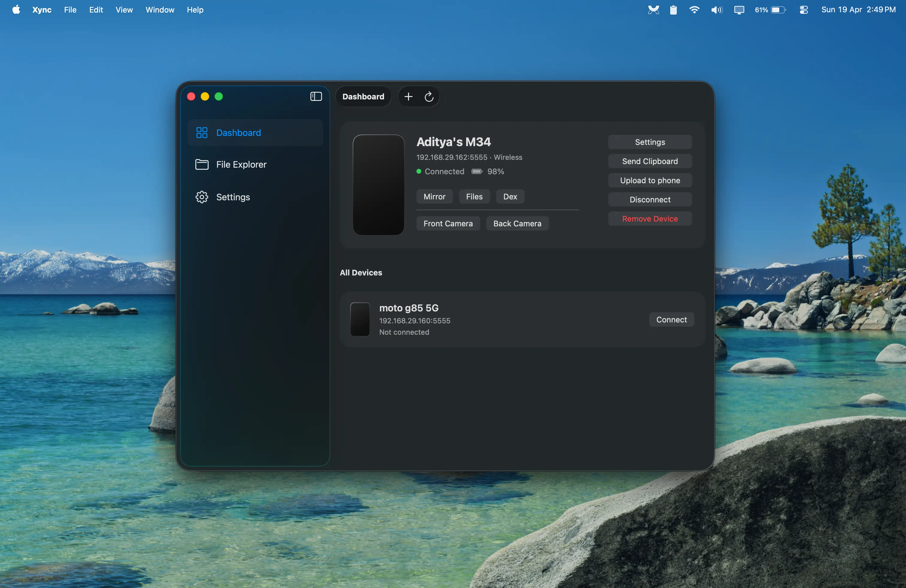
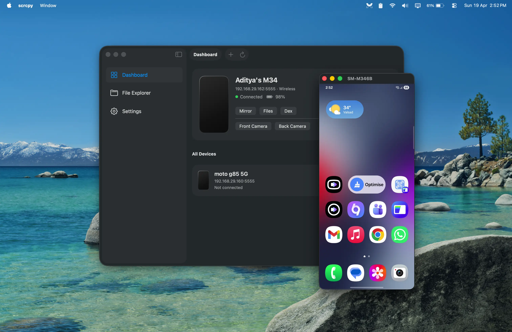
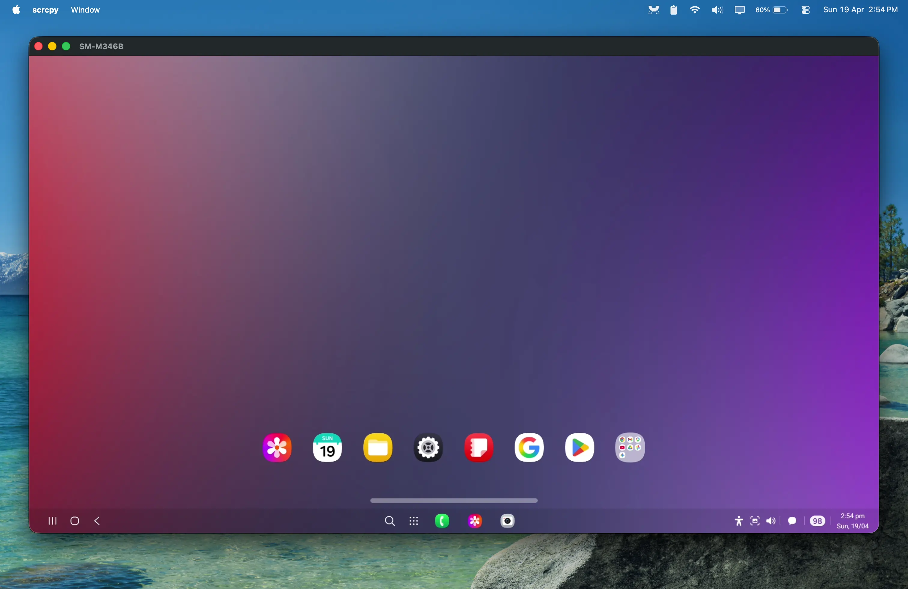
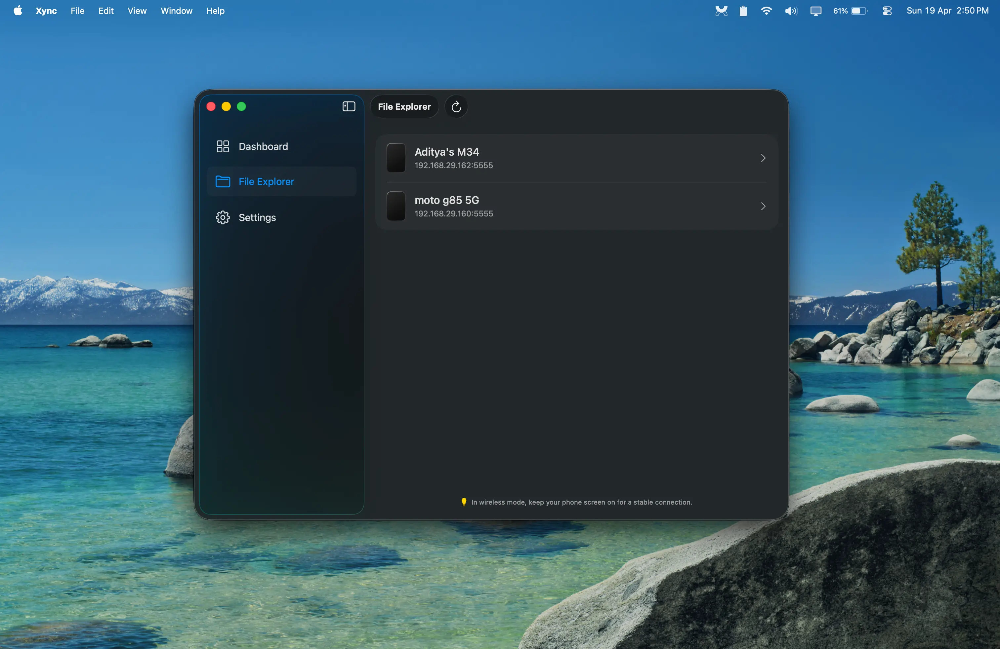
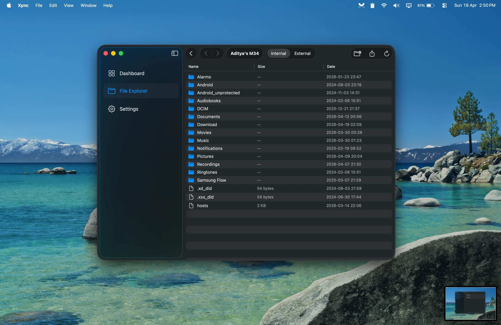
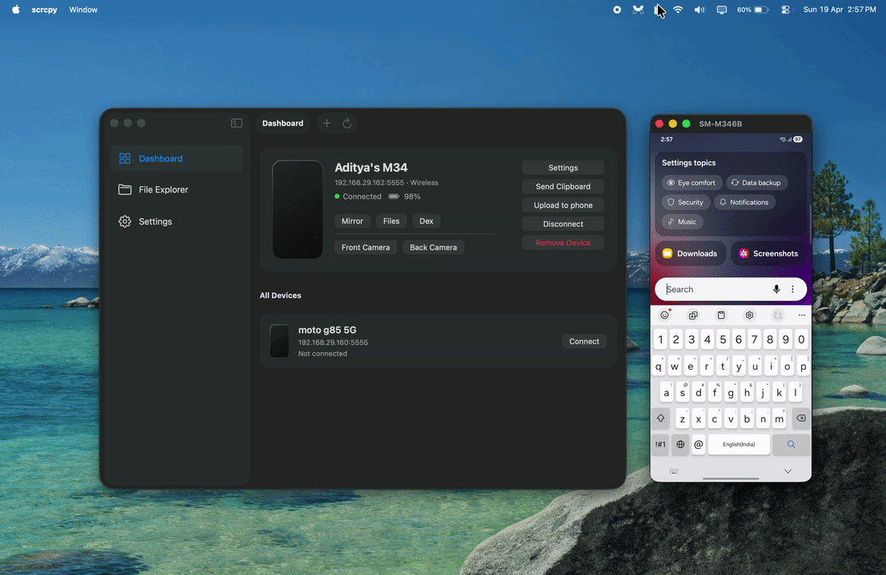
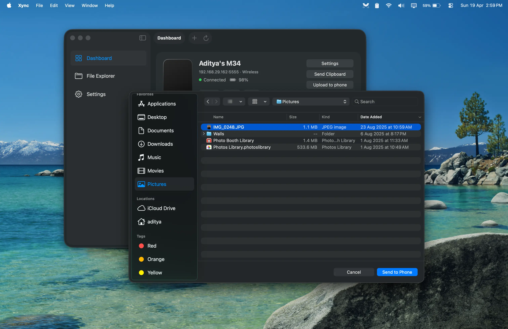
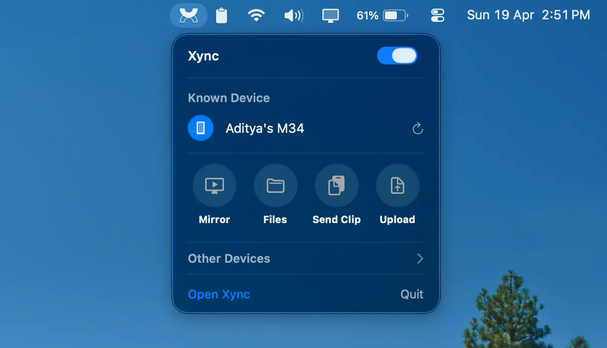

  

# Xync

**Mirror, control, and manage your Android devices wirelessly from your Mac.**

Powered by the incredible [scrcpy](https://github.com/Genymobile/scrcpy) and adb, Xync provides a beautiful, native macOS interface for managing your Android devices without touching a terminal.

## Dashboard

## Mirroring

## Samsung DeX

  Maynot work on every samsung devices try at your own luck!

## File Explorer

## Live Clipboard

## Send Files To Phone

## Menu

## Features
- **Wireless Mirroring**: Connect and mirror your phone over Wi-Fi with zero cable clutter. Built-in Connection Wizard makes TCP/IP setup a breeze.
- **Wired Mirroring**: Low-latency, high-performance USB mirroring for gaming or intensive tasks.
- **Samsung DeX**: Launch a dedicated DeX desktop environment instead of a phone mirror (requires supported Samsung device).
- **Device Camera**: Use your Android phone's high-quality rear or front camera directly on your Mac.
- **Device Management**: Forget, disconnect, or connect saved devices easily with a click.
- **Native macOS UI**: Built entirely in Swift/SwiftUI with macOS design paradigms.
- **File Explorer**: Browse, manage, and download files from your Android device directly on your Mac.
- **Live Clipboard Sync**: Instantly send your Mac's clipboard text to your phone with a single click.
- **File Transfer**: Quickly push files from your Mac to your Android.
- **Menu Bar Quick Actions**: Control your devices from the macOS menu bar for a seamless workflow.

## Prerequisites

Xync uses the open-source engines `scrcpy` and `adb` under the hood. 

The **first time you open Xync**, a built-in Setup Wizard will automatically download and configure everything you need! You don't need to touch a terminal or install anything manually.

### Android Device Setup
1. Open **Settings** on your Android phone.
2. Go to **About Phone** and tap **Build Number** 7 times to enable Developer Mode.
3. Go back to Settings -> **Developer Options**.
4. Enable **USB Debugging**.
5. Connect your phone to your Mac via USB and accept the "Allow USB Debugging" prompt on your phone's screen.

### Wireless Connection Setup & Tips
To connect wirelessly, **both your Mac and Android device must be on the exact same Wi-Fi network.**

**Pro-Tip: Set a Static IP for 1-Click Connections**
By default, routers change your phone's IP address every few days, meaning you'd have to plug your USB back in to run the Connection Wizard again. To fix this and connect instantly forever:
1. Go to your Android's **Wi-Fi Settings**.
2. Tap the gear icon next to your current Wi-Fi network and look for **IP settings**.
3. Change it from **DHCP** to **Static**.
4. Use the Connection Wizard in Xync to connect one last time. From now on, you can connect from the "Saved Devices" list anytime without cables!

## Installation

1. Go to the [Releases](https://github.com/adipanchal/xync/releases) page.
2. Download the latest `Xync.dmg`.
3. Drag the **Xync** application into your `Applications` folder.

*(Note: Because this is an indie app, macOS Gatekeeper may block the first launch. Simply **Right-click** the Xync app, and choose **Open**, then click "Open" on the warning dialog to bypass this once.)*

---

## License

 Copyright 2026 Aditya Panchal

 Licensed under the Apache License, Version 2.0 (the "License");
 you may not use this file except in compliance with the License.
 You may obtain a copy of the License at

     http://www.apache.org/licenses/LICENSE-2.0

 Unless required by applicable law or agreed to in writing, software
 distributed under the License is distributed on an "AS IS" BASIS,
 WITHOUT WARRANTIES OR CONDITIONS OF ANY KIND, either express or implied.
 See the License for the specific language governing permissions and
 limitations under the License.

